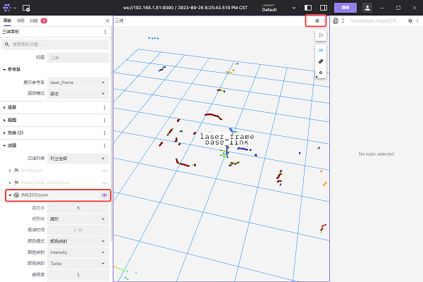

# 功能介绍

tros_oradar_lidar_ms200包用于连接Oradar MS200激光雷达，以ROS2标准消息格式发送激光雷达数据。

# 物品清单

| 物料选项    | 清单      | 
| ------- | ------------ | 
| RDK X3  | [购买链接](https://developer.horizon.ai/sunrise) | 
| 奥比中光 MS200 | [购买链接](https://detail.tmall.com/item.htm?abbucket=4&id=706184556245&rn=079d616b9d44563c5768b03d2f9685c3&spm=a1z10.5-b-s.w4011-22651484606.62.47611e0b5uUKiZ&skuId=5137196470232) | 

# 使用方法

## 准备工作

1. 地平线RDK已烧录好地平线提供的Ubuntu 20.04系统镜像。

2. 奥比中光MS200正确链接RDK X3

## 安装奥比中光MS200驱动

通过终端或者VNC连接RDK X3，执行以下命令

```bash
sudo apt update
sudo apt install -y tros_oradar_lidar_ms200
```
## 运行奥比中光MS200

在RDK终端中，执行以下命令启动MS200

```bash
source /opt/tros/setup.bash
ros2 launch tros_oradar_lidar_ms200 ms200_scan.launch.py
```

## 查看雷达数据

### 方式1 命令行方式

新打开一个终端，在里面输入以下命令查看激光雷达输出数据

```bash
source /opt/tros/setup.bash
ros2 topic echo /MS200/scan
```

### 方式2 使用foxglove可视化

***注意：运行Foxglove Studio的设备应与RDK设备处于同一网段***

1. 前往foxglove[官网下载](https://foxglove.dev/download)Foxglove Studio,并在PC上进行安装

2. 新打开一个RDK终端并输入以下命令安装rosbridge

```bash
sudo apt install ros-foxy-rosbridge-suite
```

3. 运行以下命令启动rosbridge

```bash
source /opt/tros/setup.bash
ros2 launch rosbridge_server rosbridge_websocket_launch.xml
```
4. 打开Foxglove Studio，选择“打开连接”，在接下来的对话框中选择rosbridge连接方式，并填入RDK的ip地址取代localhost


5. 在foxglove studio中点击右上角的“设置”按钮，在左侧弹出的面板中将雷达话题配置“可见”，此时studio中讲实时显示雷达点图



### 方式3 使用RVIZ方式可视化

在PC或者支持RVIZ的环境下安装ROS2，这里以foxy版本为例，运行

```bash
source /opt/ros/foxy/setup.bash
ros2 run rviz2 rviz2
```

# 接口说明

## 话题

### 发布话题
| 话题                | 类型                    | 描述                                      |
|----------------------|-------------------------|--------------------------------------------------|
| /MS200/scan               | sensor_msgs/LaserScan   | 二维激光雷达扫描数据                |

## 参数

   | 参数名      | 数据类型 | 描述                                                         |
   | ----------- | -------- | ------------------------------------------------------------ |
   | frame_id    | string   | 激光雷达坐标系名称。 默认为laser_frame                       |
   | scan_topic  | string   | LaserScan主题名。 默认为scan                                 |
   | port_name   | string   | 激光雷达串口名称。 默认值为/dev/ttyACM0                      |
   | baudrate    | int      | 雷达串口波特率.。 默认值为230400                             |
   | angle_min   | double   | 最小角度，单位度，取值范围[0, 360]。 默认值为0 |
   | angle_max   | double   | 最大角度，单位度，取值范围[0, 360]。 默认值为360 |
   | range_min   | double   | 最小距离，单位米，默认值为0.05                               |
   | range_max   | double   | 最大距离，单位米，默认值为20.0                               |
   | clockwise    | bool     | 配置点云方向，true为顺时针， false为逆时针。默认为false |
   | motor_speed | int      | 雷达转速，单位Hz，取值范围为5~15Hz。默认值为10Hz             |